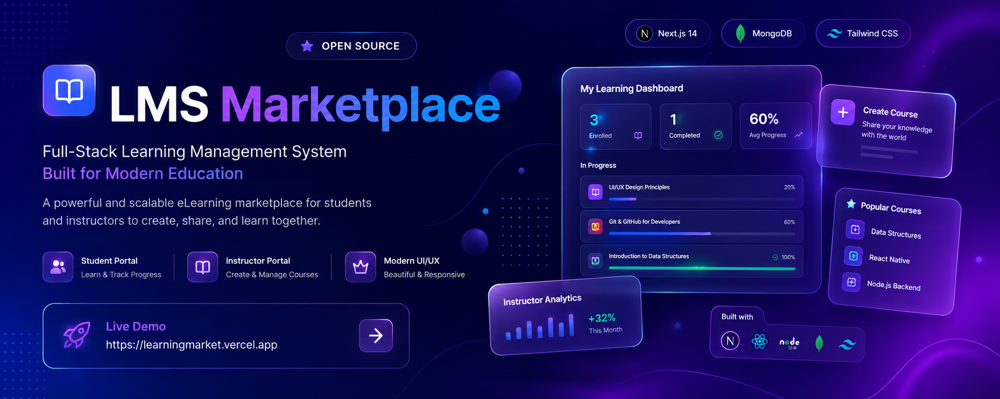
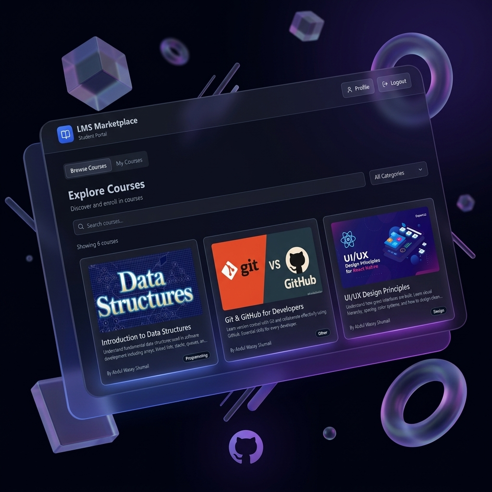
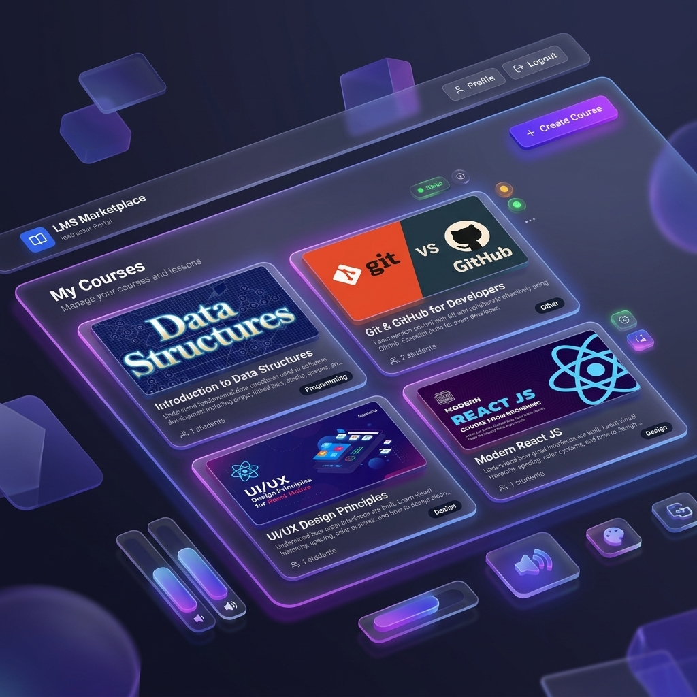
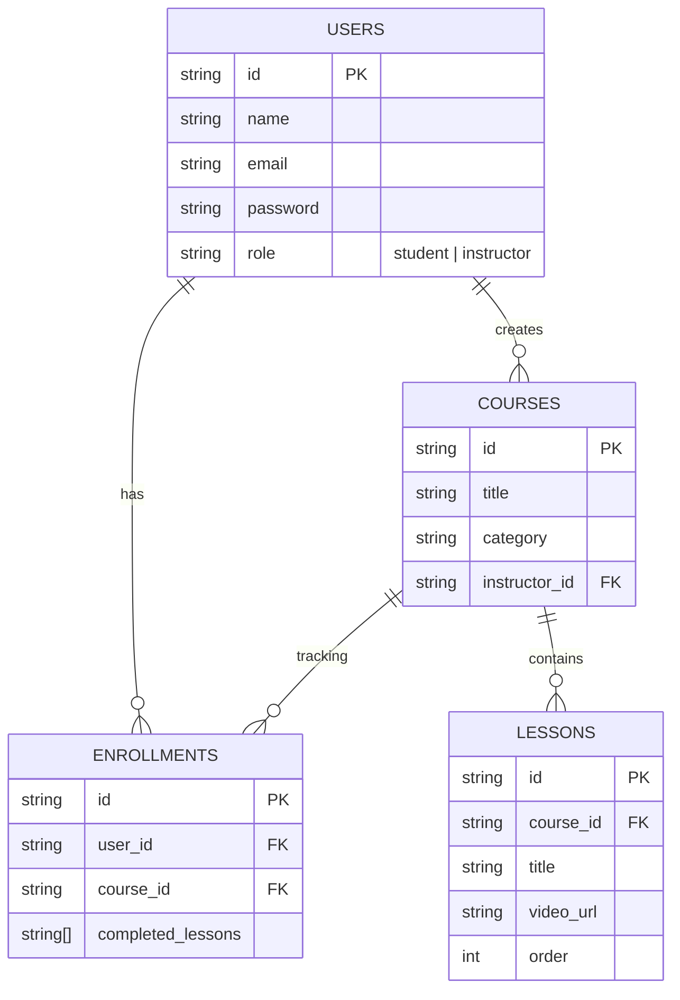

<div align="center">
  
  
  <br />
  <br />

  <h1>LMS Marketplace (v2)</h1>
  
  <p>
    <strong>A next-generation, open-source Learning Management System for students and instructors.</strong>
  </p>
  
  <p>
    <a href="https://learningmarket.vercel.app"></a>
    
    
    
  </p>
</div>

<hr />

## ✨ Features

**LMS Marketplace** is split into two seamless portals, providing a dynamic experience for both learners and educators.

### 🎓 For Students
- **Explore & Enroll**: Browse a comprehensive marketplace of courses.
- **Track Progress**: Real-time progress tracking for every enrolled course and lesson.
- **Seamless Video Learning**: Embedded YouTube lessons for high-performance playback.
- **Modern Dashboard**: A sleek, intuitive student portal to manage learning paths.

### 👨‍🏫 For Instructors
- **Course Creation Studio**: Build robust courses with custom thumbnails and descriptions.
- **Curriculum Management**: Easily arrange, edit, or remove video lessons.
- **Enrollment Analytics**: Track student enrollment metrics across your courses.
- **Instructor Dashboard**: A powerful control center for all educator tools.

---

## 📸 Showcases

<div align="center">
  <h3>Student Portal</h3>
  
  <br/><br/>
  <h3>Instructor Dashboard</h3>
  
</div>

---

## 🛠️ Technology Stack

| Category | Technologies |
| --- | --- |
| **Framework** | Next.js 14, React 18 |
| **Styling** | Tailwind CSS, shadcn/ui (Radix) |
| **Database** | MongoDB |
| **Authentication** | JWT (JSON Web Tokens), bcryptjs |

---

## 🗄️ Database Architecture



---

## 🚀 Getting Started

### 1. Clone the repository
```bash
git clone https://github.com/AbdulWasay0029/Real-World-LMS-eLearning-Marketplace-V2.git
cd Real-World-LMS-eLearning-Marketplace-V2
```

### 2. Install Dependencies
```bash
npm install
# or
yarn install
```

### 3. Setup Environment Variables
Create a `.env` file in the root directory:
```env
MONGO_URL=mongodb://localhost:27017
DB_NAME=lms_marketplace
JWT_SECRET=your_super_secret_key
NEXT_PUBLIC_BASE_URL=http://localhost:3000
```

### 4. Run the Development Server
```bash
npm run dev
# or
yarn dev
```
Navigate to `http://localhost:3000` to view the application!

<hr />
<div align="center">
  <p>Built with ❤️ by Abdul Wasay</p>
</div>
